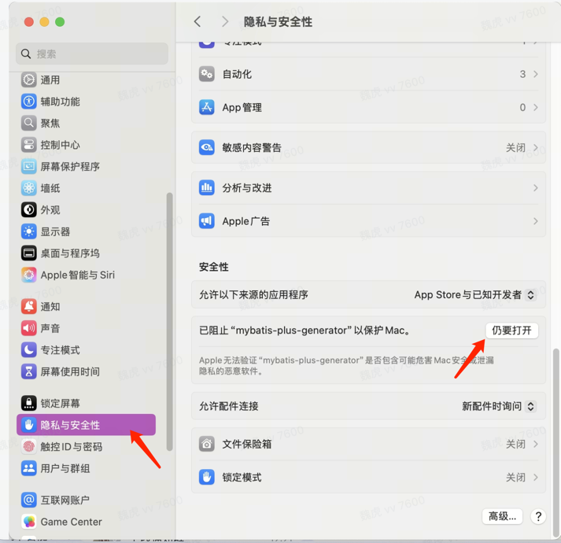

# mybatis-plus-generator
mybatis plus java code generator,but is use go(mybatis plus 代码自动生成器，但是是用golang实现，简单便捷，开箱即用，无需安装任何其他依赖)

## 使用

## 源码方式运行

直接运行`main`方法

访问 http://localhost:8080 进入主界面


输入sql

比如

```sql
create table "order"
(
    id           bigserial,
    uid          bigint  not null,
    order_id     bigint  not null,
    order_status text,
    product_num  integer not null,
    device_id    text,
    device       text,
    version      text,
    add_time     timestamp(0) default now(),
    update_time  timestamp(0),
    influhub_uid bigint,
    pay_amount   numeric
);

comment on table influhub_order is '订单表';

comment on column influhub_order.uid is '订单uid';

comment on column influhub_order.order_id is '订单id';

comment on column influhub_order.order_status is '订单状态(ORDER_CREATE（下单）、ORDER_CANCEL（全单取消）、ORDER_PART_CANCEL（部分取消）、ORDER_SIGN（确认收货）、ORDER_REFUND（订单退款）)';

comment on column influhub_order.currency is '币种';

comment on column influhub_order.product_num is '商品数量';

comment on column influhub_order.device_id is '设备id';

comment on column influhub_order.device is '渠道(web、pc)';

comment on column influhub_order.version is '订单版本';

comment on column influhub_order.influhub_uid is 'uid';

comment on column influhub_order.pay_amount is '订单支付金额';
```

注意表名如果是数据库保留管关键字，需要加""

- 效果


> 目前仅对Postgresql进行了测试,mysql还没有测试

## 安装包运行方式

[releases](https://github.com/weihubs/mybatis-plus-generator/releases)页面下载符合自己系统的二进制可执行文件

下载完解压双击运行。然后在浏览器访问`http://localhost:8080`

如果遇到MAC应用无法打开或提示“来自身份不明开发者”

解决方法：
设置→安全与隐私 仍要打开


## 从源码构建

项目提供了多种构建脚本以生成适用于不同操作系统的可执行文件：

### 一键多平台构建（推荐）

```bash
# 进入脚本目录
cd scripts

# 运行多平台构建脚本
./build-all-platforms.sh
```

构建完成后，所有平台的可执行文件将位于`build`目录中：
- Linux AMD64: `mybatis-plus-generator-linux-amd64`
- Linux ARM64: `mybatis-plus-generator-linux-arm64`
- macOS AMD64: `mybatis-plus-generator-darwin-amd64`
- macOS ARM64: `mybatis-plus-generator-darwin-arm64`
- Windows AMD64: `mybatis-plus-generator-windows-amd64.exe`

### 单平台构建脚本

项目还提供了针对特定平台的构建脚本：
- `build-macos-arm.sh` - 构建macOS ARM64版本
- `build-macos-x86.sh` - 构建macOS AMD64版本
- `build-windows-64.sh` - 构建Windows AMD64版本

**注意**：所有构建脚本都需要系统已安装Go环境（版本1.16或更高）才能成功构建。

### 安装Go环境

如果运行构建脚本时提示`go: command not found`，请先安装Go环境：

**macOS用户**：
- 方法1（推荐）：访问[Go官方下载页面](https://golang.org/dl/)下载适用于macOS ARM64的安装包
- 方法2：使用Homebrew安装：
  ```bash
  brew install go
  ```

**Linux用户**：
- Ubuntu/Debian：
  ```bash
  sudo apt update
  sudo apt install golang-go
  ```
- CentOS/RHEL/Fedora：
  ```bash
  sudo dnf install golang
  ```

**Windows用户**：
- 访问[Go官方下载页面](https://golang.org/dl/)下载适用于Windows的安装包

安装完成后，可以通过以下命令验证：

```bash
go version
```

如果显示版本号，说明安装成功。


# 为什么要写这个库

市面上的`mybatis plus` 代码生成器有很多，但是都不太满足自己的要求。

在使用`mybatis plus`自己会有一个规范，就是不要将`mybatis plus`的`Warpper`暴露到`DAO`以外的层级，特别是`Service`层

不然造成的后果就是`Warpper`在`Service`满天飞。然后有如下弊端

1. `Service`层充满了数据查询的各种`Warpper`，逻辑不够解耦，导致应该在数据层的逻辑全部暴露在`Service`层
2. `Service`层的数据查询没有封装无法复用

所以我们一般使用`mybatis plus`的标准用法结构是

- infra
  - dao
    - mapper
      - OrderMapper.java
    - impl
      - OrderDAOImpl.java
  OrderDAO.java
  - entity
    - OrderDO.java

具体的代码如下：

- OrderDO

```java
@Data
public class OrderDO {

}
```

- OrderMapper

```java
@Mapper
public interface OrderMapper extends BaseMapper<OrderDO> {
}
```

- OrderDAO

```java
public interface OrderDAO extends IService<OrderDO> {
}
```

- OrderDAOImpl

```java
@Repository
@RequiredArgsConstructor
public class OrderDAOImpl extends ServiceImpl<OrderMapper, OrderDO> implements OrderDAO {

    private final InfluhubOrderMapper influhub_orderMapper;
}
```

在外部只使用`OrderDAO`，将`Wrapper`相关的逻辑都封装在`DAO`中，不蔓延到`Services`